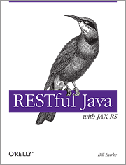

RESTful Java with JAX-RS Workbook Examples
============================================
The examples in this directory are a compliment to the O'Reilly "RESTful Java with JAX-RS" book.  This book has
a detailed explanation of REST and JAX-RS.  The appendix of the book also walks through all the example code provided within
this directory.

